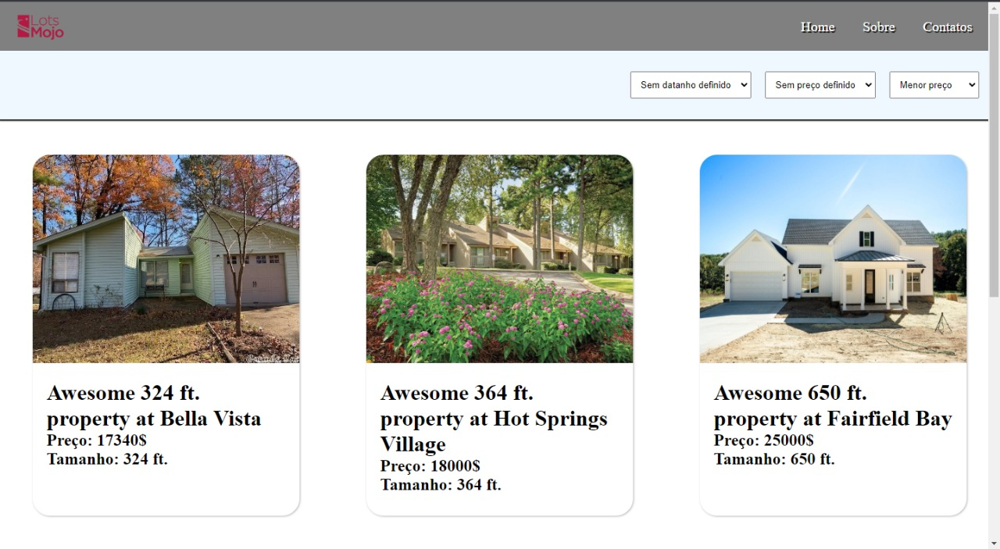

<h1>Site para LotsMojo</h1>

Esse site foi feito para o teste para a vaga de desenvolvedor Front-End da Lots Mojo. Ele consiste em tres paginas: Home, infos, aquisition

Para deixar o site responsivo, as paginas são organizada de um jeito para poder mostrar o conteudo mais organizado para os diferentes tipos de depositivos

##

<h2>Home</h2>

Essa é a tela principal, onde irá listar todas as propriedades que estão a venda. Essas informações vem do back-end e organizado conforme seu preço ou tamanho

<h3>Desktop</h3>

<h3>Mobile</h3>

<h2>infos</h2>

Essa tela mostra as informações de cada propriedade, mostrando outras fotos que podem conter e seus detalhes, para o cliente saber como ela é

<h3>Desktop</h3>

<h3>Mobile</h3>

<h2>aquisition</h2>
